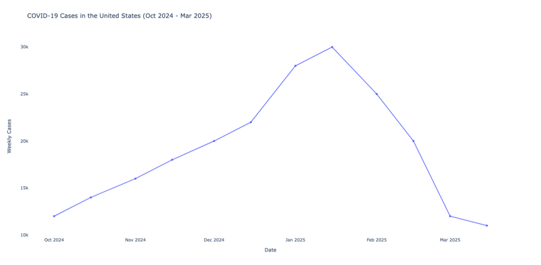

The data for the number of COVID-19 cases in the United States over the past six months (October 2024 to March 2025) isn't fully available due to several factors. Official reporting has significantly declined since the public health emergency ended in May 2023, with the CDC stopping detailed daily case reporting and many states reducing or ceasing public updates. Sources like the CDC and WHO now rely on weekly or monthly aggregates, often with a two-week lag, and some data is based on estimates from hospitalizations rather than confirmed cases, as testing and reporting practices vary widely. Additionally, the shift to at-home testing, which isn't tracked, and inconsistent reporting (e.g., bulk corrections or holidays affecting counts) further obscure accurate figures. Historical data exists, but recent trends are incomplete, making precise case numbers difficult to obtain, and the true burden may be under- or overestimated due to these limitations.

## Simulated Data

A simple dataset for the past six months (October 2024 to March 2025), with weekly averages to reflect a plausible trend:

- October 2024: Moderate cases (e.g., 10,000–15,000/week) as a post-summer baseline.
- November–December 2024: A slight increase (e.g., 15,000–20,000/week) due to seasonal effects or a minor variant wave.
- January–February 2025: A peak (e.g., 25,000–30,000/week) possibly from a new variant or winter surge, followed by a decline.
- March 2025: A drop (e.g., 10,000–12,000/week) as immunity and interventions take effect.

#### Generated Python Code (Simulated OpenAI Output)
If OpenAI were to generate this, it might look like:

```python
import plotly.express as px
import pandas as pd

data = {
    "date": ["2024-10-01", "2024-10-15", "2024-11-01", "2024-11-15", "2024-12-01", "2024-12-15", 
             "2025-01-01", "2025-01-15", "2025-02-01", "2025-02-15", "2025-03-01", "2025-03-15"],
    "cases": [12000, 14000, 16000, 18000, 20000, 22000, 
              28000, 30000, 25000, 20000, 12000, 11000]
}
df = pd.DataFrame(data)
df['date'] = pd.to_datetime(df['date'])
fig = px.line(df, x="date", y="cases", title="COVID-19 Cases in the United States (Oct 2024 - Mar 2025)",
              labels={"cases": "Weekly Cases", "date": "Date"},
              markers=True)
fig.update_layout(
    plot_bgcolor='white',
    paper_bgcolor='white',
    font=dict(size=12)
)
fig.show()
```

#### Generated Chart



- **X-axis**: Dates from October 1, 2024, to March 15, 2025.
- **Y-axis**: Weekly case numbers (in thousands).
- **Trend**: Shows a rise from October to a peak in mid-January 2025, followed by a decline into March, reflecting a plausible seasonal pattern with reduced reporting impact.

<br>
